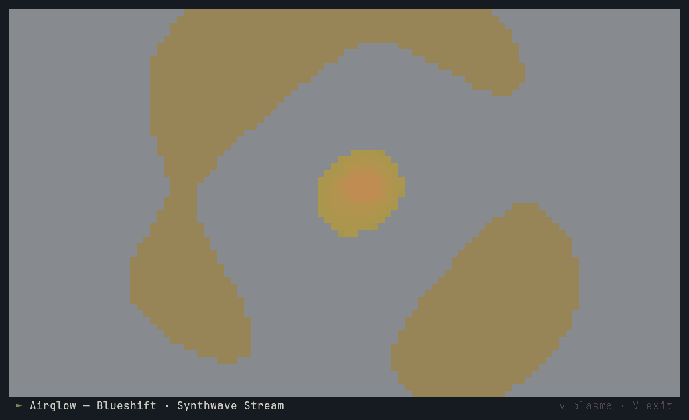
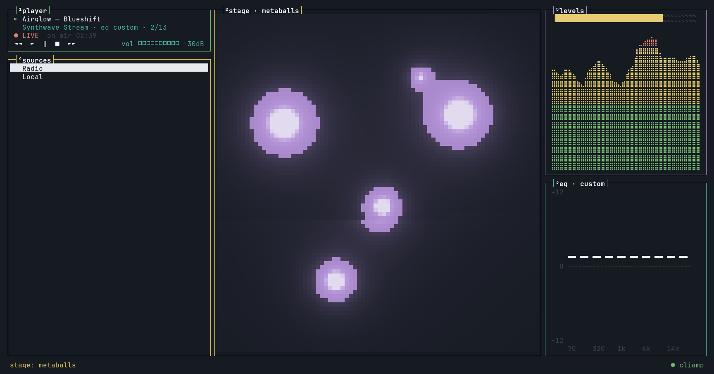
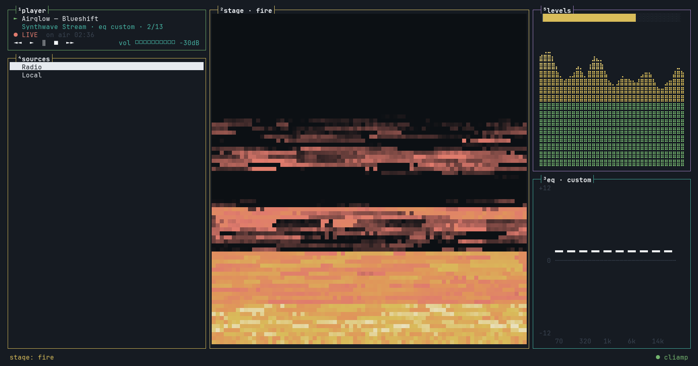
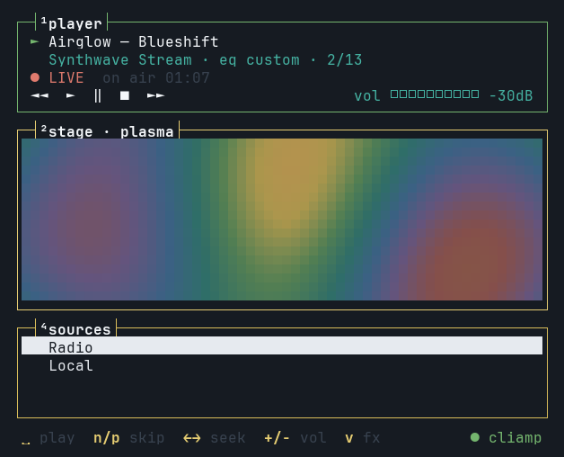
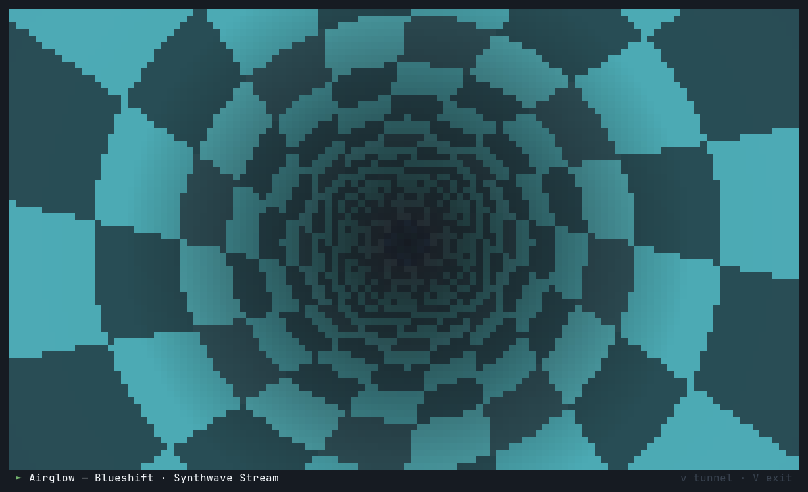

# cliamp-deck

Alternative terminal UI for [cliamp](https://github.com/bjarneo/cliamp): a btop-style grid and a Winamp-style
player that re-flow with the terminal, plus a stage of audio-reactive demoscene effects painted in your Omarchy
theme's colours. All audio, providers and the spectrum come from a running cliamp over its V2 IPC socket.



| | |
|---|---|
|  |  |
|  |  |

Shown in Omarchy's Slate Dark theme, playing a cliamp radio stream.

Needs [cliamp](https://github.com/bjarneo/cliamp) installed (Omarchy ships it) and a truecolor terminal. On start it
asks the running cliamp which remote operations it supports, and exits with an update hint if any it uses are missing.

```sh
go install github.com/demian0311/cliamp-deck@latest
cliamp-deck                                   # starts `cliamp --daemon` if nothing is running
cliamp-deck --spawn=false --socket PATH       # attach to a specific instance only
```

Layout: player on top, visualizer in the middle, sources at the bottom (side by side on very wide terminals).
Click the visualizer, or press Enter on it, to let it take over the terminal; click or Esc to come back.

Keys: space play/pause · n/p skip · , . seek · +/- volume · Tab focus player → visualizer → sources (the focused panel's title turns negative) ·
in the player: ↑/↓ volume, → EQ (←/→ band, ↑/↓ gain, p preset, 0 off, ← past the first band back to the player) ·
v or ‹ › cycle visualizers (←/→ when it has focus) · V take over · e EQ from anywhere ·
in sources: ↑/↓ move, → open a source or country, ← back (Radio lists countries; open one for its stations), Enter play, a add to queue, A play next, [ ] tabs (sources/queue/history), / search,
s set up a source with `cliamp setup` · q quit. Mouse: click and double-click rows, scroll the list, click tabs.

The deck remembers your EQ and visualizer in `~/.config/cliamp-deck/state.toml` (cliamp's daemon does not
save EQ) and reapplies the EQ when it attaches.

Stage effects live in `fx/` (interface: pixel frame + bass/mid/treble/beat + theme). Each cell is a `▀`
with 24-bit fg/bg, so the terminal must support truecolor. Colours come from the Omarchy theme at
`~/.local/state/omarchy/current/theme/colors.toml` (override: `--theme PATH`), re-read within 2 s of
`omarchy theme set`.

Known limits (2026-09-26):
- `spectrum.get` serves 10 bands; the deck interpolates to braille resolution.
- A cliamp *TUI* instance only refreshes its bands while its own visualizer renders, so attached to one
  the spectrum can freeze. Run cliamp as `--daemon` for a live spectrum.
- Providers only appear once configured in cliamp's config (e.g. Spotify needs a `[spotify]` section).
- Titles with wide (CJK/emoji) glyphs will misalign the grid.

Screenshots are real captures: the deck runs in tmux against a cliamp playing into a PipeWire null sink
(`PIPEWIRE_NODE=<null sink>`), `tmux capture-pane -e` dumps each frame, and `docs/screenshots/ansi2png.py`
renders it with the current Omarchy theme's terminal palette.
