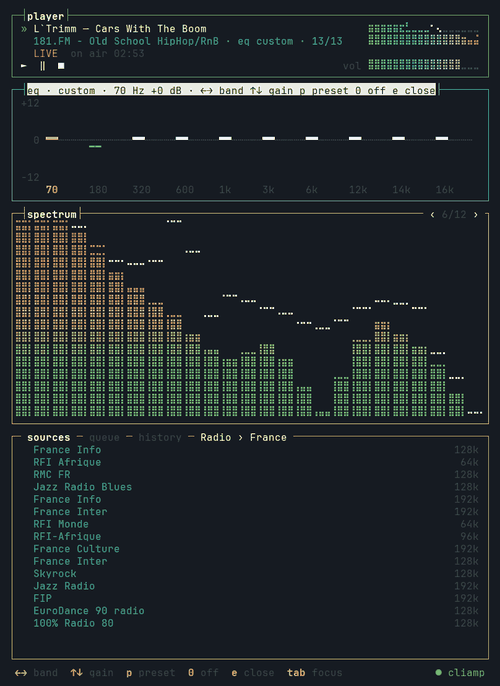
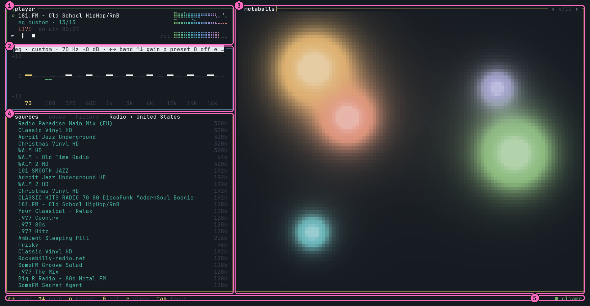
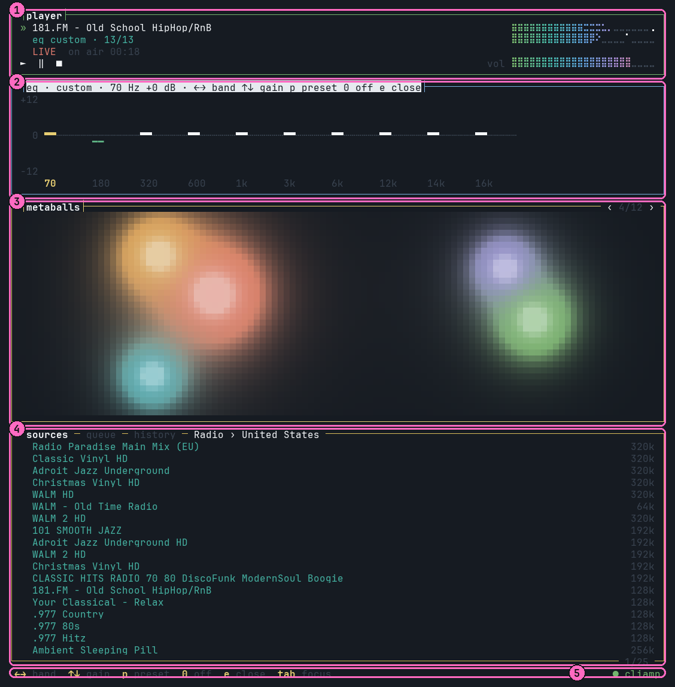
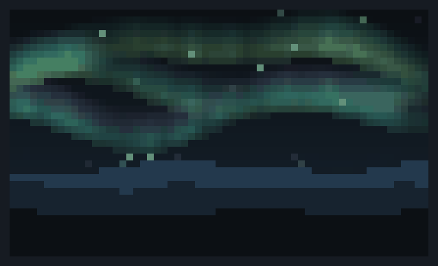
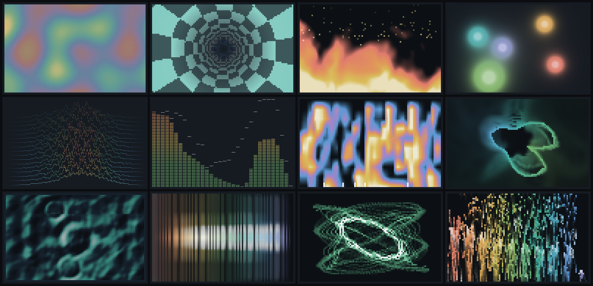
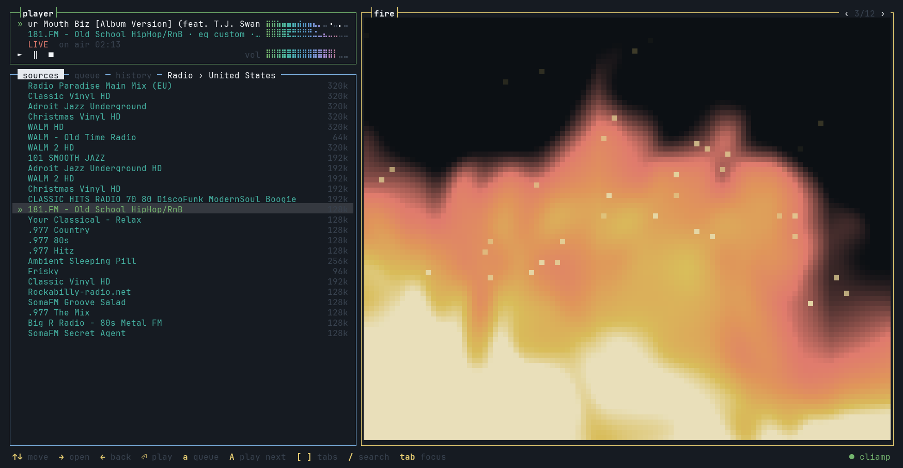
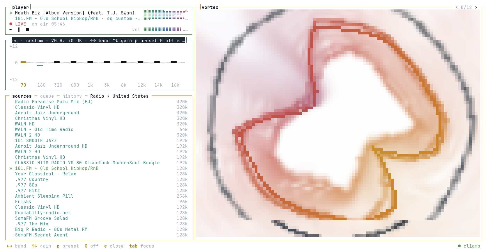
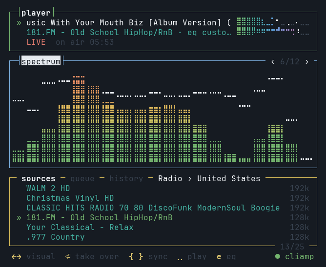

# cliamp-deck

<p align="center">
  
</p>
<p align="center"><sub>Player, EQ, visualizer and playlist stacked in one narrow window, the way Winamp sat on a 2000s desktop.</sub></p>

Alternative terminal UI for [cliamp](https://github.com/bjarneo/cliamp): a btop-style grid and a Winamp-style
player that re-flow with the terminal, plus a stage of audio-reactive demoscene effects painted in your Omarchy
theme's colours. All audio, providers and the spectrum come from a running cliamp over its V2 IPC socket.

## The display



<table>
<tr>
<td width="55%"></td>
<td>

1. **Player**: what's playing and from which station, live or elapsed time, the level meters and volume, and
   the play/pause/stop controls.
2. **EQ**: ten bands with cliamp's presets. `e` opens and closes it from anywhere; it is hidden until you want it.
3. **Visualizer**: `v` or the `‹ n/N ›` arrows cycle the effects; click it or press Enter to take over the whole
   terminal. Spectrum, the default, stays as short as the player and stands in for its level meter, leaving the
   room to the list.
4. **Sources**: cliamp's sources (radio by country, plus anything else you have set up), with **queue** and
   **history** tabs.
5. **Status line**: the keys for whichever panel has focus (Tab moves focus), and whether cliamp is connected.

A wide terminal puts the visualizer beside the other panels (above). A narrower or taller one stacks them
(left). Resize the terminal and the panels move to fit; down to 30 columns every panel stays, giving up detail
instead (the tabs collapse to the active one, long titles scroll).

</td>
</tr>
</table>

## Visualizers



Over fifteen visualizers, all reacting to the music and all painted from your theme — plasma, fire, metaballs,
ridges, spectrum, timescope, vortex, water, synaesthesia, scope, fountain, aurora, skyline, coral, flow, life, moire
and braille:



## Sources and themes

Browse cliamp's sources — internet radio by country, plus whatever else you have set up — with the player, levels
and a visualizer alongside:



| | |
|---|---|
|  |  |
| Light themes work too: the EQ open, vortex drawn as ink on paper. | A small terminal stacks the panels; spectrum stays as short as the player. |

Screenshots in Omarchy's Slate Dark and Slate Light themes, playing a cliamp radio stream.

## Install (Omarchy)

cliamp ships with Omarchy, so all you need is the deck. One line installs it to `~/.local/bin` and adds it to the
app launcher (Super + Space) with cliamp's icon. No sudo, nothing to compile:

```sh
curl -fsSL https://raw.githubusercontent.com/demian0311/cliamp-deck/master/install.sh | bash
```

Run the same line again to update. To remove it and its launcher entry:

```sh
curl -fsSL https://raw.githubusercontent.com/demian0311/cliamp-deck/master/install.sh | bash -s -- --uninstall
```

The script downloads the release binary for your CPU and checks it against the release's `SHA256SUMS`; read
[`install.sh`](install.sh) first if you prefer.

**Or as a pacman package** (x86_64), so `omarchy update` keeps it current. One line adds the signed
`[cliamp-deck]` repository and installs it:

```sh
curl -LO https://github.com/demian0311/cliamp-deck/releases/download/arch-repo/cliamp-deck-keyring.pkg.tar.zst &&
  sudo pacman -U ./cliamp-deck-keyring.pkg.tar.zst && sudo pacman -Sy cliamp-deck
```

**Elsewhere, or from source** — needs Go; on Omarchy `mise use -g go@latest` provides it:

```sh
GOBIN=~/.local/bin go install github.com/demian0311/cliamp-deck@latest
```

Any Linux with cliamp v2.0.1 or newer and a truecolor terminal works. On start the deck asks the running cliamp
which remote operations it supports, and exits with an update hint if any it uses are missing.

```sh
cliamp-deck                                   # starts `cliamp --daemon` if nothing is running
cliamp-deck --spawn=false --socket PATH       # attach to a specific instance only
```

## Using it

Layout: player on top, visualizer in the middle, sources at the bottom (side by side on very wide terminals).
Click the visualizer, or press Enter on it, to let it take over the terminal; click or Esc to come back.

Quitting the deck stops the music: a headless `cliamp --daemon` exits with it, a cliamp TUI just stops playing
(`--keep-playing` leaves it running).

Keys: space play/pause · n/p skip · , . seek · +/- volume · Tab focus player → visualizer → sources (the focused panel's title sits on an accent tint) ·
in the player: ↑/↓ volume, ←/→ seek · e shows or hides the EQ from anywhere (←/→ band, ↑/↓ gain, p preset, 0 off) ·
v or ‹ › cycle visualizers (←/→ when it has focus) · V take over · { } move the picture 10 ms earlier/later
against the sound (Bluetooth adds its own delay) ·
in sources: ↑/↓ move, → open a source or country, ← back (Radio lists countries; open one for its stations), Enter play, a add to queue, A play next, [ ] tabs (sources/queue/history), / search,
s set up a source with `cliamp setup` · q quit. Mouse: click and double-click rows, scroll the list, click tabs.

The deck remembers your EQ, visualizer, sync delay and last station or track in `~/.config/cliamp-deck/state.toml` (cliamp's
daemon does not save EQ). When it attaches it reapplies the EQ and, if nothing is playing, starts that station again.

Stage effects live in `fx/` (interface: pixel frame + bass/mid/treble/beat + theme). Each cell is a `▀`
with 24-bit fg/bg, so the terminal must support truecolor. Colours come from the Omarchy theme at
`~/.local/state/omarchy/current/theme/colors.toml` (override: `--theme PATH`), re-read within 2 s of
`omarchy theme set`.

Known limits (2026-09-26):
- `spectrum.get` serves 10 bands and no waveform; every visualizer and the level meter work from those bands
  (scope draws its figures from them, not from the real signal).
- A cliamp *TUI* instance only refreshes its bands while its own visualizer renders, so attached to one
  the visualizers can freeze. Run cliamp as `--daemon` for live bands.
- Providers only appear once configured in cliamp's config (e.g. Spotify needs a `[spotify]` section).
- Titles with wide (CJK/emoji) glyphs will misalign the grid.

Screenshots are real captures: a second `cliamp --daemon` (own `CLIAMP_CONFIG_DIR`, `--audio-device` a PipeWire
null sink, so nothing is heard) plays a radio stream, the deck runs in a private tmux server
(`tmux -L shots`, `terminal-features '*:RGB'`) with `TMUX` unset, `TERM=xterm-256color` and `COLORTERM=truecolor` — otherwise it
detects tmux and falls back to 256 colours — and `tmux capture-pane -e` dumps each frame. `docs/screenshots/ansi2png.py`
renders it with a theme's terminal palette (`THEME_DIR=<omarchy theme dir>`, default the applied theme).
